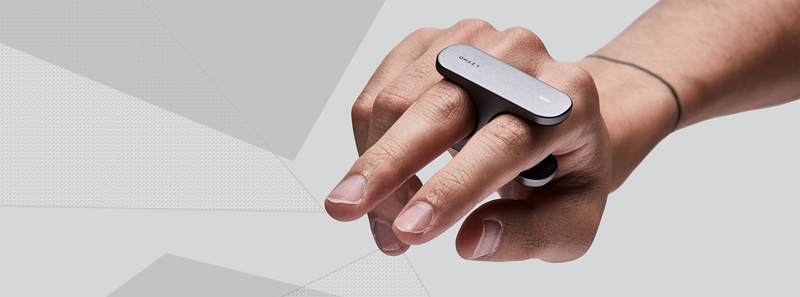

# Using a Litho Device on Windows

_Litho beta release 0.5.0 (13/11/2019)_

---

## Contents

* [Litho on Windows](#litho-on-windows)

---

## Litho on Windows

Please note - use of a Litho device with Windows is currently [alpha-quality](README.md).

To opt in to testing this Alpha quality feature, uncomment the `WINDOWS_BLUETOOTH_ALPHA_OPTIN` definition in `Litho/Core/Scripts/Interaction/Litho.cs`.

#### Known Issues

* Scanning for devices is currently not possible. See "Pairing to a device" workaround below.
* Occasionally, connection will take a long time to be established, or will not be established at all. If connection takes more than ~15s, you may need to exit and re-start play mode.
* If the above does not work, you may need to switch your computer to Flight Mode for 10 seconds, close and re-open Unity, then try again.
* Battery level will not be reported
* Firmware version will not be checked

#### Pairing to a device

Scanning for devices on Windows is currently not supported. You must instead pair to your device using the Settings app. 

1. Open the Bluetooth Settings menu.

2. Select "Add Bluetooth or other device"

3. Select "Bluetooth"

4. Select your Litho device

5. Once your Litho has been paired, press "Done"

---

# Navigation

[Home](../README.md)

[Litho Features](../Features/README.md)

[Guide to using Litho](../Manual/UsingLitho.md)

[Set up your Litho project](../Manual/ProjectSetup.md)

[Learn how the Litho demo scene works](../Manual/DemoScene.md)

[Build your scene for iOS or Android](../Manual/BuildInstructions.md)

[Integrate Litho into your Unity scene](../Manual/UnityIntegration.md)

[Code your own Litho scripts](../Manual/UnityScripting.md)

[Test your scene using the Litho Emulator](../Features/LithoEmulator.md)

[FAQs & Troubleshooting](../FAQ.md)

[Changelog](../Changelog.md)

---
