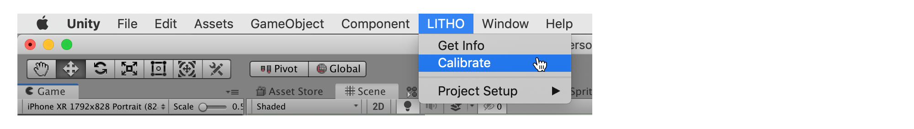
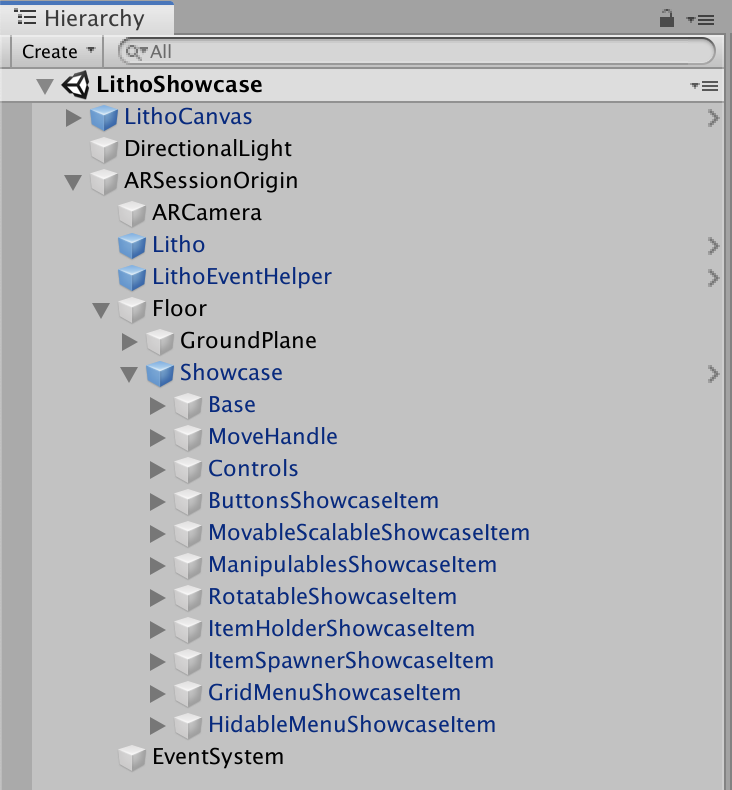

# Learn how the Litho demo scene works

_Litho beta release 0.4.2 (16/10/2019)_

## Contents

* [Video Tutorial](#video-tutorial)
* [Instructions for the Litho Showcase Scene](#instructions-for-the-litho-showcase-scene)
* [Litho Showcase Scene Overview](#litho-showcase-scene-overview)

---

## Video tutorial

<a href="https://vimeo.com/361262684#t=171s" target="_blank">

Watch the setup tutorial on Vimeo</a>

---

## Instructions for the Litho showcase scene

1. **Open the showcase scene** (_/Litho/Scenes/LithoShowcase.unity_)

2. **Press _Play_** to run the scene (the _Play_ button should remain depressed and glow blue)

3. **Move your mouse over the Game view** to begin interacting with the scene using the [Litho Emulator](../Features/LithoEmulator.md) - use left-click (and hold) to interact using Litho; use right-click and drag (with W, A, S, D keys) to move the camera around

4. Open the Litho dropdown menu by clicking the hamburger icon in the top-right corner of the Game view - this is where you can connect to Litho on **Mac and mobile devices** only

5. If using Unity on Mac, **wait for your Litho device name to appear** on the list in the Game view. Ensure Bluetooth is enabled on your Mac and that your Litho device is charged - plug it in to charge if unsure. This may take a short while the first time you run the scene

4. In the Game view, **connect to your Litho** device by clicking its corresponding "Connect" button - the button will update to say it is "Connecting..." - wait briefly while the connection is established

5. **Calibrate your Litho** with the Unity editor:

    **Calibrate in game view:**
    1. Swipe through the Litho dropdown menu to the Litho device details tab (look for a picture of a Litho at the top)
    2. Make sure you are wearing Litho in the correct grip (configured by your app on the device details screen; default is [Point grip](UsingLitho.md#litho-grips))
    3. Point in an arbitrary direction (e.g. towards your screen) to use as 'forwards' whilst testing your app
    4. Click the _Calibrate Litho_ button

    **Calibrate using the Unity Menu:**

    
    1. Make sure you are wearing Litho in the correct grip (configured by your app; default is [Point grip](UsingLitho.md#litho-grips))
    2. Point in an arbitrary direction (e.g. towards your screen) to use as 'forwards' whilst testing your app
    3. In the Unity Editor menu bar press _LITHO -> Calibrate_

6. You should now be able to **see the laser pointer** protruding from the _Litho_ object, which should be tracking your real-world Litho position and orientation relative to the _ARCamera_ object

7. By **pointing at the cube** in the game world, and **touching and holding the touchpad** on the bottom of your Litho, you should be able to **manipulate the cube** in 3D space. Whilst holding in [Point grip](UsingLitho.md#litho-grips), twist your wrist left and right to move the cube along the axis of the pointer

8. When finished, click the _Play_ button again to **stop the scene** (the _Play_ button should return to its unpressed state)

---

## Litho showcase scene overview

>More detailed information is available [here](UnityIntegration.md#).

| Description | Unity Editor |
| :--- | :--- |
|<ol> <li> **LithoCanvas** \- contains a hierarchy of UI components and a _UIManager_ that interact with the components that control UI for device selection, device info, and calibration </li> <li> **ARSessionOrigin** \- contains a custom Litho _WorldInterpreter_ script that handles basic plane identification and ground plane management, as well as the default session management components for an AR Foundation scene (see [AR Foundation](https://docs.unity3d.com/Packages/com.unity.xr.arfoundation@2.0/manual/index.html)) </li> <li> **ARCamera** \- has default AR Foundation camera management components on it, including the _Tracked Pose Driver_, which allows the Unity game camera position to match the real world camera position once the app is built </li> <li> **Litho** \- gets positioned by its _Litho_ component and exposes Litho-related events; also hosts a [`Pointer`](UnityScripting.md#pointer) script which handles interaction with GameObjects hosting the [`Manipulable`](UnityScripting.md#manipulable) component </li> <li> **LithoEventHelper** \- hosts an instance of the _LithoGlobalEventLogger_ component, which demonstrates how to subscribe to global Litho events (exposed by the _Litho_ object) - feel free to delete this object if you already understand Litho global events </li> <li> **Floor** \- gets positioned at the detected ground level by the _WorldInterpreter_ component on the _ARSessionOrigin_ object </li> <li> **Demo Objects** \- several objects that are Manipulable by the Litho [`Pointer`](UnityScripting.md#pointer) in a variety of ways - remove, replace, or modify these objects to develop your Litho app! </li> </ol> |  |

---

# Navigation

[Litho Features](../Features/README.md)

[Guide to using Litho](UsingLitho.md)

[Set up your Litho project](ProjectSetup.md)

[Learn how the Litho demo scene works](DemoScene.md)

[Build your scene for iOS or Android](BuildInstructions.md)

[Integrate Litho into your Unity scene](UnityIntegration.md)

[Code your own Litho scripts](UnityScripting.md)

[Test your scene using the Litho Emulator](../Features/LithoEmulator.md)

[FAQs & Troubleshooting](FAQ.md)

[Changelog](../Changelog.md)

---
