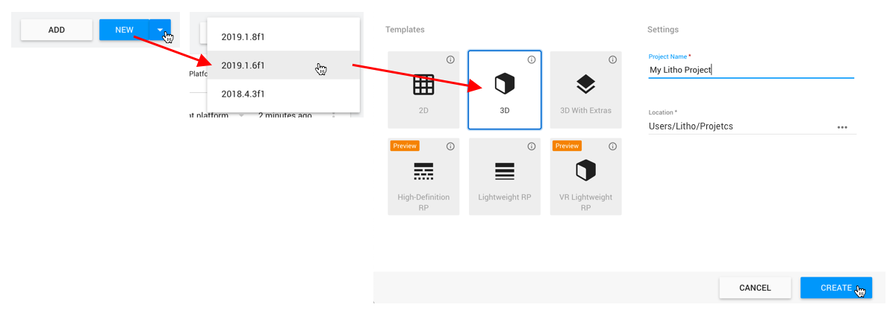

# Set up your Litho project

_Litho beta release 0.4.4 (30/10/2019)_

## Contents

* [Video Tutorial](#video-tutorial)
* [Instructions for first use of the Litho SDK](#instructions-for-first-use-of-the-litho-sdk)

---

## Video tutorial

<a href="https://vimeo.com/368558994" target="_blank">

Watch the setup tutorial on Vimeo</a>

---

## Instructions for first use of the Litho SDK:

> _If you have issues with this process, try following the more detailed instructions [here](ProjectSetupDetailed.md)_

#### 1. Create your project:

1. Open **Unity Hub**
2. Ensure you have **Unity version 2019.2** installed; in Unity Hub, go to _Installs_ and either find the required version, or click _Add_ to install  it. Alternatively, you can download different versions of Unity [here](https://unity3d.com/get-unity/download/archive) 
    - _Other Unity versions may work but are not yet tested_
    - _Alpha and beta versions are not recommended_ 
    - _Older versions are unlikely to support the required AR Unity packages_
3. Ensure the chosen Unity version has **iOS Build Support** or **Android Build Support** installed, as relevant. Note that you must have one of these options installed.
    - _If not installed, the additional options menu (three dots next to the chosen Unity version on the Installs tab) should allow you to install it via the _Add Modules_ option_
    
    
4. On the Projects screen, use the dropdown menu next to the _New_ button to create a **new 3D project** with Unity **2019.2**, then open it.

---

#### 2. Import the Litho Unity package into your Unity project:

1. Locate the Litho SDK _.zip_ file (e.g. _litho-beta-2019-10-16-v0-4-2.zip_) - i.e. find it in your downloads folder, or download it if you have not done so already
2. Unzip/ decompress the Litho SDK _.zip_ file
3. Using Mac's Finder app or Windows Explore (in a new window), open the root folder of the Unity project you created for Litho
4. Drag and drop the unzipped Litho package (e.g. _Litho_ or _litho-beta-2019-10-16-v0-4-2_; note **not** _.zip_) into the _Packages_ folder of your Unity project
5. If you are upgrading your Litho SDK package from a previous version, you can now delete the old version (however Unity should automatically use the latest version)
6. Return to your project in Unity - Unity will automatically install the Litho assets into your project; these assets can be found in the Unity _Project_ window, under _Litho Beta SDK_

---

#### 3. Prepare your project:

1. Click **_LITHO -> Project Setup -> Update Project Settings_** in the Unity Editor menu bar (this will update Unity Player settings and a few other settings relevant to mobile builds)
2. If your project supports iOS devices, click **_LITHO -> Project Setup -> Import iOS Packages_** in the Unity Editor menu bar (this will automatically install ARKit packages and switch to iOS build platform)
3. If your project supports Android devices, click **_LITHO -> Project Setup -> Import Android Packages_** in the Unity Editor menu bar (this will automatically install ARCore packages and switch to Android build platform)

4. If your project supports **iOS** devices, check that mobile architecture is set appropriately (only ARM64 is supported by ARKit):
    - In Unity, go to **_Project Settings -> Player -> iOS tab (click the mobile phone icon) -> Other Settings -> Configuration_**
    - Set **_Architecture_ to ARM64**
5. If your project supports **Android** devices, check that Vulkan Graphics API is disabled (as it is not supported by ARCore):
    - In Unity, go to **_Project Settings -> Player -> Android tab (click the Android icon) -> Other Settings -> Rendering -> Graphics APIs_**
    - Select **Vulkan**
    - Click the minus (_-_) icon to **remove it from the list**
6. Check that your graphics settings are suitable for mobile devices - this will be application specific:
    - Look in **_Project Settings -> Quality_**
    - Make sure the _default level_ for your chosen platform is high enough to support your desired graphics settings (click the arrow at the bottom of the list of Levels to change the default)
    - It is recommended that you **enable shadows**, as these greatly improve AR experiences - the default level for your chosen platform will likely need to be at least **_Medium_** for this
    - Check _Project Settings -> Graphics_ for other graphics settings

---

#### 4. Set up your Game view for mobile compatibility:

>_The Litho user interface is designed for iPhone X (2436x1125, Portrait), however other resolutions should scale dynamically_

1. Open the Game view (_Window -> General -> Game_)
2. Open the resolution drop-down menu in the top-left of the Game view (it may read as _"Free Aspect"_ or _"iPhone 5 Tall"_, for example)
3. Select your chosen mobile phone screen resolution or create a new option by clicking the "+" at the bottom of the list - the options available will depend on the build platform selected in Unity Build Settings
4. Ensure the _Scale_ slider is set to the lowest possible value

---

# Navigation

[Home](../README.md)

[Litho Features](../Features/README.md)

[Guide to using Litho](UsingLitho.md)

\> [Set up your Litho project](ProjectSetup.md)

[Learn how the Litho demo scene works](DemoScene.md)

[Build your scene for iOS or Android](BuildInstructions.md)

[Integrate Litho into your Unity scene](UnityIntegration.md)

[Code your own Litho scripts](UnityScripting.md)

[Test your scene using the Litho Emulator](../Features/LithoEmulator.md)

[FAQs & Troubleshooting](../FAQ.md)

[Changelog](../Changelog.md)

---
