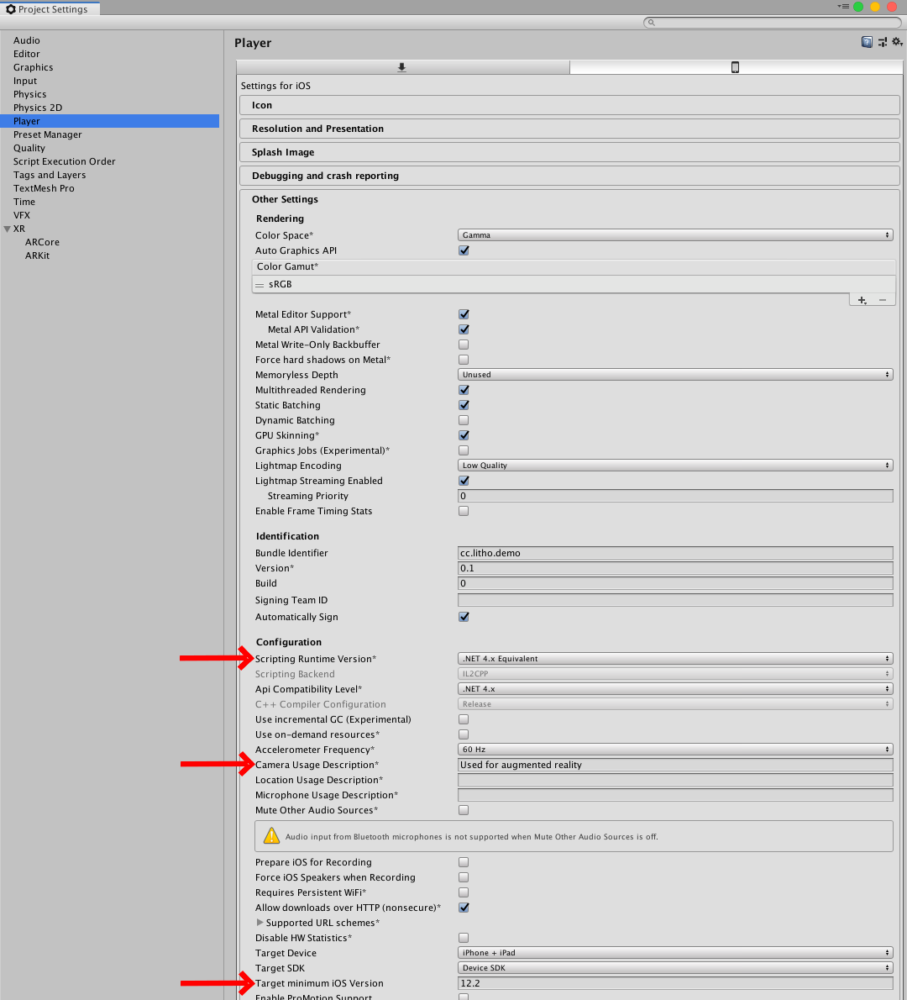
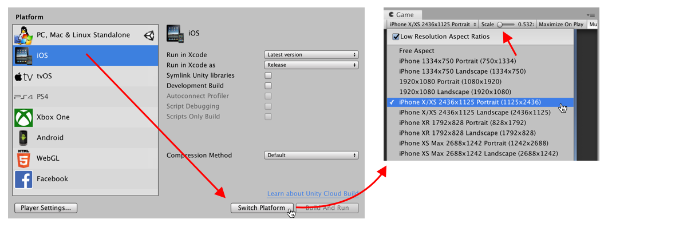

# Set up your Litho project manually

_Litho beta release 0.5.0 (13/11/2019)_

## Contents

* [Video Tutorial](#video-tutorial)
* [Detailed instructions for setting up your Litho project](#detailed-instructions-for-setting-up-your-litho-project)

---

## Video tutorial

<a href="https://vimeo.com/368558994" target="_blank">

Watch the setup tutorial on Vimeo</a>

---

## Detailed instructions for setting up your Litho project:

Note that parts of this process can be automated using the condensed instructions [here](ProjectSetup.md).

#### 1. Create your project:

1. Open **Unity Hub**
2. Ensure you have **Unity version 2019.2** installed; in Unity Hub, go to _Installs_ and either find the required version, or click _Add_ to install  it. Alternatively, you can download different versions of Unity [here](https://unity3d.com/get-unity/download/archive) 
    - _Other Unity versions may work but are not yet tested_
    - _Alpha and beta versions are not recommended_ 
    - _Older versions are unlikely to support the required AR Unity packages_
3. Ensure the chosen Unity version has **iOS Build Support** or **Android Build Support** installed, as relevant. Note that you must have one of these options installed.
    - _If not installed, the additional options menu (three dots next to the chosen Unity version on the Installs tab) should allow you to install it via the _Add Modules_ option_
    
    
4. On the Projects screen, use the dropdown menu next to the _New_ button to create a **new 3D project** with Unity **2019.2**, then open it.

---

#### 2. Import the Litho Unity package into your Unity project:

1. Locate the Litho SDK _.zip_ file (e.g. _litho-beta-2019-09-30-v0-4-1.zip_) - i.e. find it in your downloads folder, or download it if you have not done so already
2. Unzip/ decompress the Litho SDK _.zip_ file
3. Using Mac's Finder app or Windows Explore (in a new window), open the root folder of the Unity project you created for Litho
4. Drag and drop the unzipped Litho package (e.g. _Litho_ or _litho-beta-2019-09-30-v0-4-1_; note **not** _.zip_) into the _Packages_ folder of your Unity project
5. If you are upgrading your Litho SDK package from a previous version, you can now delete the old version (however Unity should automatically use the latest version even if you don't delete the old version)
6. Return to your project in Unity - Unity will automatically install the Litho assets into your project; these assets can be found in the Unity _Project_ window, under _Litho Beta SDK_

---

#### 3. Prepare your project:

1. Open Player Settings (_Edit -> Project Settings -> Player_)
2. Select the _iOS settings_ tab (click the small mobile phone icon)
3. Expand _Other Settings_ and scroll down to find the options noted below
4. Ensure **_Scripting Runtime Version_** is set to **_.NET 4.x Equivalent_** or higher
5. Ensure **_Camera Usage Description_** is filled in with **_"Used for augmented reality"_**
6. Ensure **_Target minimum iOS Version_** is set to **_12.2_** (or whatever iOS version you intend to use)

---

#### 4. Install ARKit and ARCore:

1. Open Package Manager ( _Window -> Package Manager_)
 Ensure drop-down menu at the top-left (near the _+_ button) reads _All packages_ (not _In Project_)
2. Click _Advanced_ drop-down menu to tick _Show preview packages_ - this may cause a delay whilst additional packages load
3. Click the arrow next to **ARKit XR Plugin** to select and install **version 2.1.0 (preview.5)**
4. Click the arrow next to **ARCore XR Plugin** to select and install **version 2.1.0 (preview.5)** - later versions may be unstable, so may not build correctly

---

#### 5. Set up your Game view for mobile compatibility:

>The Litho user interface is designed for iPhone X (2436x1125, Portrait), however other resolutions should work similarly.

1. Open Build Settings (_File -> Build Settings..._)
2. Under _Platform_, select iOS, then click _Switch Platform_

3. Open the Game view (_Window -> General -> Game_)
4. Open the resolution drop-down menu in the top-left of the Game view (it may read as _"Free Aspect"_ or _"iPhone 5 Tall"_, for example)
5. Select your chosen mobile phone screen resolution or create a new option by clicking the "+" at the bottom of the list - the options available will depend on the build platform selected in Unity Build Settings
6. Ensure the _Scale_ slider is set to the lowest possible value

---

# Navigation

[Home](../README.md)

[Wearing and using Litho (external link)](https://www.litho.cc/pages/using-litho)

[Litho Features](../Features/README.md)

[Set up your Litho project](ProjectSetup.md)

[Learn how the Litho demo scene works](DemoScene.md)

[Build your scene for iOS or Android](BuildInstructions.md)

[Integrate Litho into your Unity scene](UnityIntegration.md)

[Code your own Litho scripts](UnityScripting.md)

[Test your scene using the Litho Emulator](../Features/LithoEmulator.md)

[FAQs & Troubleshooting](../FAQ.md)

[Changelog](../Changelog.md)

---
