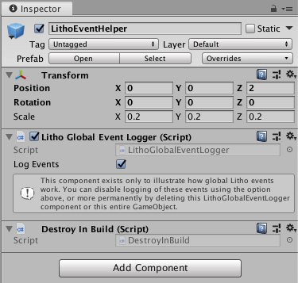

# Integrate Litho into your Unity scene

_Litho beta release 0.5.1 (02/12/2019)_

## Contents

* [Augmented Reality and Litho Interaction](#augmented-reality-and-litho-interaction)
* [Litho Showcase Scene](#litho-showcase-scene)
* [LithoARSessionOrigin Object](#lithoarsessionorigin-object)
* [ARCamera Object](#arcamera-object)
* [Litho Object](#litho-object)
* [Showcase Object](#showcase-object)
* [Litho Event Helper Prefab](#litho-event-helper-prefab)

---

## Augmented Reality and Litho Interaction

Below is a brief overview of the recommended augmented reality (AR) interaction flow to use with Litho. The AR side of the system is handled by [Unity's AR Foundation](https://docs.unity3d.com/Packages/com.unity.xr.arfoundation@2.0/manual/index.html), which is explained briefly [here](UnityIntegration.md#arsessionorigin_object). The Litho SDK sits within the AR Foundation framework, which allows you to tangibly reach into any AR experiences that you make. The following sections explain the objects that make up the Litho interaction system. The Litho showcase scene provides a smorgasbord of example implementation of the components described below.

---

## Litho Showcase Scene

The easiest way to get started with Litho is to take a look at the Litho showcase scene: it illustrates some basic types of interaction that can be achieved using Litho. You can then use the demo objects as a basis for your own interactions.

* In your Unity project, open this scene by double-clicking on _Assets/Litho/Demo/LithoShowcase/LithoShowcase.unity_ Ensure you have [set up your project](ProjectSetup.md) first.

> _It is highly recommended that you look through the features available in the Litho showcase before getting started with your own project. Future updates and new Litho interactions will be demonstrated in the showcase._

| Description | Hierarchy |
| :--- | :--- |
| <ol> <li> **_LithoUI_** hosts a canvas for managing connection to Litho and other Litho features. </li><li> **[_LithoARSessionOrigin_](#lithoarsessionorigin-object)** handles scaling and positioning of the AR session and trackables (including Litho). </li> <li> **[_ARCamera_](#arcamera-object)** handles the AR session information, such as whether to process updates. </li> <li> **[_Litho_](#litho-object)** represents the position of Litho in AR space. </li> <li> **[_Floor_](#floor-object)** represents the position of the ground in AR space. </li> <li> **[_LithoShowcase_](#showcase-object)** demonstrates some basic interaction capabilities of Litho. </li> </ol> |  |

---

## _LithoARSessionOrigin_ Object

To make Litho work in AR, the project [relies on the AR Foundation package](ProjectSetup.md#install-ar-foundation-and-arkit). This prefab contains the other Litho and AR objects required to make the scene work. A basic overview is given below, but more detail on AR Foundation can be found [here](https://docs.unity3d.com/Packages/com.unity.xr.arfoundation@2.0/manual/index.html). How Litho's interactions work in Unity is covered in more detail [here](UnityScripting.md).

| Description | Inspector |
| :--- | :--- |
| <ol> <li> **[_Transform_](https://docs.unity3d.com/ScriptReference/Transform.html)** represents spatial properties of the AR session </li> <li> **_AR Manager (Script)_** is essential for Litho to work. It interfaces with AR Foundation to allow the user to select a ground plane, then places the [_Floor_ object](#floor-object) and _Focus Object_ at the chosen position. This removes the need to scan the entire room before using the app. **Note: you will need to manually set the _Focus Object_ for every new scene you create.**</li> <li> **[_AR Session Origin (Script)_](https://docs.unity3d.com/Packages/com.unity.xr.arfoundation@latest?preview=1&subfolder=/api/UnityEngine.XR.ARFoundation.ARSessionOrigin.html)** handles coordinate information. </li> <li> **[_AR Session (Script)_](https://docs.unity3d.com/Packages/com.unity.xr.arfoundation@2.2/api/UnityEngine.XR.ARFoundation.ARSession.html) (auto-enabled at runtime)** handles the AR session information, such as whether to process updates. </li> <li> **[_AR Input Manager (Script)_](https://docs.unity3d.com/Packages/com.unity.xr.arfoundation@2.2/api/UnityEngine.XR.ARFoundation.ARInputManager.html) (added at runtime)** manages motion input (e.g. camera tracking). </li> <li> **[_AR Plane Manager (Script)_](https://docs.unity3d.com/Packages/com.unity.xr.arfoundation@2.2/api/UnityEngine.XR.ARFoundation.ARPlaneManager.html) (added at runtime)** handles creation, updates and deletion of GameObjects representing real-world planes. </li> <li> **_Don't Destroy On Load (Script)_** preserves the AR session state across scene transitions. </li> </ol> | |

---

## _ARCamera_ Object

This represents the real-world (mobile phone) AR camera and makes the Unity scene camera match its position.

| Description | Inspector |
| :--- | :--- |
| <ol> <li> **[_Transform_](https://docs.unity3d.com/ScriptReference/Transform.html)** locates the AR camera in Unity coordinates; values here will be **driven by the _AR Pose Driver_ script**. </li> <li> **[_Camera (Script)_](https://docs.unity3d.com/Packages/com.unity.xr.arfoundation@latest?preview=1&subfolder=/api/UnityEngine.XR.ARFoundation.ARSessionOrigin.html)** handles rendering of Unity objects. </li> <li> **[_AR Pose Driver (Script)_](https://docs.unity3d.com/Packages/com.unity.xr.arfoundation@2.0/manual/index.html#basic-setup)** keeps this Unity camera aligned with the real-world camera (when the app is [running on a mobile device](BuildInstructions.md#build-your-unity-project-as-an-ios-app)) </li> <li> **[_AR Camera Manager (Script)_](https://docs.unity3d.com/Packages/com.unity.xr.arfoundation@latest?preview=1&subfolder=/api/UnityEngine.XR.ARFoundation.ARCameraManager.html) (auto-enabled at runtime)** Handles camera texture and light estimation. </li> <li> **[_AR Camera Background (Script)_](https://docs.unity3d.com/Packages/com.unity.xr.arfoundation@latest?preview=1&subfolder=/api/UnityEngine.XR.ARFoundation.ARCameraBackground.html)** handles 'passthrough' of the camera video stream to the Unity camera buffer, allowing Unity objects to be rendered in front of real-world objects. </li> </ol> |  |

---

## _Litho_ Object

The _Litho_ object represents your Litho device in the scene ***(Only 1 copy of this object/ script should exist in your scene.)*** The laser pointer is cast from this object, which is automatically positioned relative to the camera. The _Litho_ object prefab can be found in the demo scene and should be a child of the _ARSessionOrigin_ object. When building your own Litho scene, make the _Litho_ prefab a child of the ARSessionOrigin object, and ensure you provide the _Litho_ object with a reference to the main AR camera object in your scene. Further details can be found [here](UnityScripting.md#litho)

| Description | Inspector |
| :--- | :--- |
| <ol> <li> **[_Transform_](https://docs.unity3d.com/ScriptReference/Transform.html)** represents the real-world position of your connected Litho in game world/AR coordinates. **Do not modify this manually or in other scripts** as it is overridden by the _Litho_ script. </li> <li> **_Litho (Script)_** needs a reference to the main AR camera to function (if not set, any object tagged with MainCamera will be used). Code in this script **should not be modified**, as it communicates directly with the Litho Plugin. However, you can set the default Litho _handedness_ and _grip_ here using the Unity Inspector window, and override the defaults whilst in play mode. </li> <li> **_Pointer (Script)_** controls the behaviour of the laser pointer and uses the Unity Line Renderer to visualize it. <ul> <li> **Ignore Layers** lets you select the layers the pointer should ignore </li><li> **Release Range** determines how far a [`Manipulable`](UnityScripting.md#manipulable) may move from where this [`Pointer`](UnityScripting.md#pointer) wants it to be before it is automatically dropped. </li> <li> **Pointer Properties** provides a set of advanced controls for how Litho touches and rotations map to object depth and yaw. </li> </ul> </li> <li> **_Line Renderer_** is a standard Unity component that renders the laser pointer. Modify the properties and materials here to change how the laser pointer looks. </li> <li> **_Game View Controller_** implements the [Litho emulator](../Features/LithoEmulator.md) and explains its controls in the Inspector window. </li> </ol> |  |

---

## _Floor_ Object

The _Floor_ object represents the height of the ground in AR space, which is updated by the _World Interpreter_ script (via the _Ground Plane_ Unity Inspector field). Objects that rest on or interact with the floor should have the _Floor_ object as their parent - this will ensure they don't get occluded (visually or physically) by the _Ground Plane_ object.

---

## _Ground Plane_ Object

The _Ground Plane_ object hosts a large box collider, which is positioned as a child of the _Floor_ object to prevent objects from falling through the floor - this simplifies AR scanning of the floor, as the entire floor becomes physically present after choosing a single point on the scanned floor.

The _Ground Plane_ object also hosts two different meshes - one for use in the Unity Editor (shows a visible plane), and one for built AR apps (implements AR occlusion and shadows). These are automatically deleted from the Editor/ builds as appropriate.

---

## _Showcase_ Object

The _Showcase_ object collates a variety of interaction prefabs into a small platform that is suitable for manipulation in AR. The interaction prefabs serve as examples of how to implement interactions with the Litho [`Pointer`](UnityScripting.md#pointer). The examples can be navigated by using the Litho pointer to click the arrow buttons on the showcase platform. Inspect these these objects in the Unity Hierarchy window to learn more about how to implement different interactions, and look [here](UnityScripting.md#basic-interaction-components) for more details.

> Note: the _Showcase_ object is set as the _Focus Object_ of the `ARManager` on the [_LithoARSessionOrigin_ object](#lithoarsessionorigin-object) - this ensures it is positioned correctly when a ground plane is selected.

| Game View | Hierarchy and Inspector |
| :- | :- |
|  |  |

> More information about how these showcase objects work is provided [here](UnityScripting.md#basic-interaction-components).

---

## _Litho Event Helper_ Prefab

The _Litho Event Helper_ object can be added to your scene to help you understand [Litho global events(UnityScripting.md#litho-events) prints Litho global events (and their parameters) to the Unity Console as they happen. This event logging can be toggled on or off using the _Log Global Litho Events_ field.

The _Litho Event Helper_ object is not critical to the Litho system - **you can delete this object** without any issues occurring, or simply disable the _Litho Global Event Logger_ script (uncheck the _Log Global Litho Events_ field) if the logging becomes obtrusive.

The code in the Litho Global Event Logger script can also be viewed as an example of how to access the events exposed by the Litho script - other code samples for Litho events can be found [here](UnityScripting.md#code-samples).

---

# Navigation

[Home](../README.md)

[Wearing and using Litho (external link)](https://www.litho.cc/pages/using-litho)

[Litho Features](../Features/README.md)

[Set up your Litho project](ProjectSetup.md)

[Learn how the Litho demo scene works](DemoScene.md)

[Build your scene for iOS or Android](BuildInstructions.md)

\> [Integrate Litho into your Unity scene](UnityIntegration.md)

[Code your own Litho scripts](UnityScripting.md)

[Test your scene using the Litho Emulator](../Features/LithoEmulator.md)

[FAQs & Troubleshooting](../FAQ.md)

[Changelog](../Changelog.md)

---
