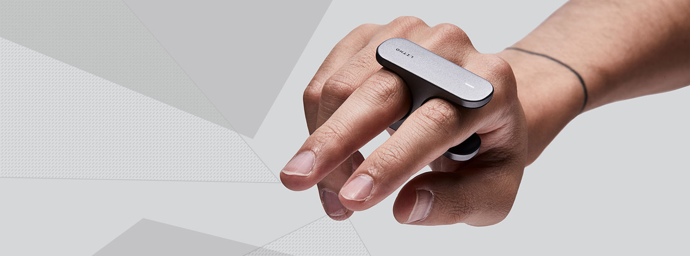
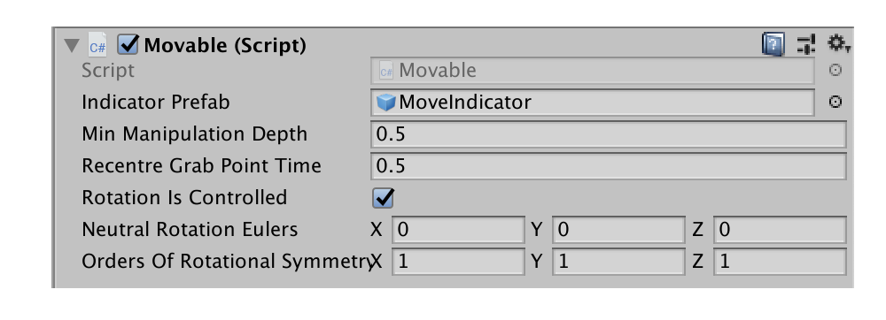
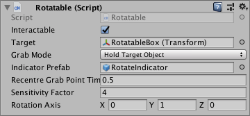
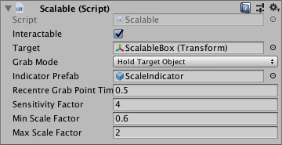

# Scripting with Litho

[](#)
_Litho beta release 0.4.3 (28/10/2019)_

## Contents

* [Basic Interaction Components](#basic-interaction-components)
* [Interaction Components Used By Litho](#interaction-components-used-by-litho)
* [Litho Events](#litho-events)
* [Code Samples](#code-samples)

---

## Basic Interaction Components

#### `Litho`

This component acts as an interface between Litho hardware and Unity. It connects to Litho devices and forwards information about them to your Unity apps, via [Litho events](#litho_events). Note that the [Litho emulator](../Features/LithoEmulator.md) can also produce (fake) Litho events in response to your mouse interactions within the Unity Editor's Game view.

#### `Manipulable`

This component represents that the Unity GameObject it is attached to can be interacted with by the Litho interaction system. It has some basic properties (listed below) that modify how it works, as well as a [comprehensive range of events](#list-of-manipulable-events).

* **_Interactable_** determines whether this `Manipulable` object is currently responding to [`Manipulator`](#manipulator) interactions.

* **_Target_** determines which object is affected by this Manipulable (Note: By default, the closest ancestor GameObject with a `Rigidbody` component will be targeted. Additionally, it is completely fine for a `Manipulable` to target itself).

* **_Grab Mode_** determines whether an interacting [`Manipulator`](#manipulator) grabs the target object or this `Manipulable` handle object.

* **_Indicator Prefab_** determines which prefab to display near the object to indicate that this `Manipulable` is being interacted with.

This component can be used to respond to [`Manipulator`](#manipulator) interactions directly, but it is designed to be inherited from. Several Litho classes already inherit from `Manipulable`, and can be used as examples: [`Positionable`](#positionable), [`Movable`](#movable), [`Scalable`](#scalable), [`Rotatable`](#rotatable), [`Selectable`](#selectable), [`Hidable`](#hidable).

> `Manipulable` components may be attached to objects in different configurations and with different targets to achieve different interactions - refer  to the _LithoShowcase_ scene for a variety of examples.

`Manipulable` GameObjects must have at least one Unity `Collider` component attached to them or attached to one of their child GameObjects in order for a [`Manipulation`](#manipulation) to occur. Additionally, the `Collider`(s) must be assigned to a Unity physics layer that is not ignored by a given [`Manipulator`](#manipulator) in order for that [`Manipulator`](#manipulator) to interact with the `Manipulable`.

#### `Manipulator`

This component represents that the Unity GameObject it is attached to can establish interactions with [`Manipulable`](#manipulable) objects by triggering [events](#list-of-manipulable-events) on them. It has some basic properties (listed below) that modify how it works. The `Manipulator` class itself is abstract, so cannot be attached to objects directly, but it is inherited by a selection of different implementations, including the [`Pointer`](#pointer) class, which extends its functionality to work using the Litho hardware as input.

* **_Strength_** determines the strength of this `Manipulator` compared to other `Manipulator`s when performing interactions.

* **_Ignore Layers_** determines which Unity physics layers should *not* be considered when determining what this `Manipulator` is interacting with.

* **_Release Range_** determines how far a [`Manipulable`](#manipulable) may move from this `Manipulator`'s target grab position before it is released (use -1 to make the range infinite).


#### `Manipulation`

This component is automatically generated on [`Manipulable`](#manipulable)s by [`Manipulator`](#manipulator)s when a hover event begins, and is destroyed when the [`Manipulator`](#manipulator) ends its interaction with (i.e. stops hovering and stops grabbing) the [`Manipulable`](#manipulable). It represents the state of the interaction, which is unique to the [`Manipulable`](#manipulable)-[`Manipulator`](#manipulator) pair.

A reference to this component is passed along with each [`Manipulable`](#manipulable) event that is triggered, providing event handlers with information about the manipulation:

* `Manipulator` indicates which [`Manipulator`](#manipulator) is involved in this `Manipulation`.

* `Manipulable` indicates which [`Manipulable`](#manipulable) is involved in this `Manipulation`.

* `StartTime` indicates when this `Manipulation` started, in Unity time.

* `GrabPosition` indicates the point at which the interaction is taking place (e.g. the handle point by which the [`Manipulator`](#manipulator) is holding the [`Manipulable`](#manipulable)).

* `InitialManipulablePosition` and `InitialManipulableRotation` indicate the initial position and rotation of the [`Manipulable`](#manipulable).

* `IsHovered` indicates whether the [`Manipulable`](#manipulable) is currently being hovered (highlighted) by the [`Manipulator`](#manipulator).

* `IsGrabbed` indicates whether the [`Manipulable`](#manipulable) is currently being grabbed (e.g. for a [`Pointer`](#pointer), the Litho touchpad is pressed) by the [`Manipulator`](#manipulator).

* `Indicator` indicates which GameObject in the scene is showing that this `Manipulation` is occurring.

---

## Specific Types of [`Manipulable`](#manipulable) (Objects That Can Be Manipulated)

#### `Positionable`

This component can be attached to a GameObject with a Rigidbody to allow it to be grabbed and repositioned by a [`Manipulator`](#manipulator). Attaching this component to a child of a GameObject with a Rigidbody will make that child a 'handle' by which the Rigidbody can be moved. `Positionable` exposes the following properties in the Unity Inspector (in addition to those of [`Manipulable`](#manipulable)):

* **_Recentre Grab Point Time_** determines how long it should take for the point by which the object is being held to transition to the centre of the object.

* **_Counteract Gravity_** determines whether this [`Manipulable`](#manipulable) should be affected by gravity whilst being manipulated.

#### `Movable`

This component extends upon the functionality of [`Positionable`](#positionable). It can be attached to a GameObject with a Rigidbody to allow it to be grabbed, repositioned and rotated by a [`Manipulator`](#manipulator). Attaching this component to a child of a GameObject with a Rigidbody will make that child a 'handle' by which the Rigidbody can be manipulated. `Movable` exposes the following properties in the Unity Inspector (in addition to those of [`Manipulable`](#manipulable) and [`Positionable`](#positionable)):

* **_Rotation Is Controlled_** determines whether this [`Manipulable`](#manipulable) should override control of the object's rotation.

* **_Neutral Orientation Eulers_** represents the x,y,z Euler angles the object will have when it is considered to be stood upright (zeros are most common here).

* **_Orders Of Rotational Symmetry_** represents the number of orientations about each axis that are equivalent to each other (e.g. a cube has 4 equivalent orientations about each axis).

[](#)

#### `Rotatable`

This component implements precise angular control of the target object about the given rotation axis - this is controlled by pointing left or right whilst grabbing this [`Manipulable`](#manipulable) GameObject (typically a parent GameObject). It can be attached to any GameObject (which will then act as the 'handle' of the rotation manipulation), and set to target any GameObject. `Rotatable` exposes the following properties in the Unity Inspector (in addition to those of [`Manipulable`](#manipulable)):

* **_Sensitivity Factor_** determines how sensitive this [`Manipulable`](#manipulable) should be to [`Manipulator`](#manipulator) motion.

* **_Rotation Axis_** determines which axis (local to the target) the rotation should occur around.

[](#)

#### `Scalable`

This component implements precise scale (size) control of the target object - this is controlled by pointing up or down whilst grabbing this [`Manipulable`](#manipulable) GameObject. It can be attached to any GameObject (which will then act as the 'handle' of the scaling manipulation), and set to target any GameObject (typically a parent GameObject). `Scalable` exposes the following properties in the Unity Inspector (in addition to those of [`Manipulable`](#manipulable)):

* **_Sensitivity Factor_** determines how sensitive this [`Manipulable`](#manipulable) should be to [`Manipulator`](#manipulator) motion.

* **_Min Scale Factor_** represents the smallest scale factor (comparing current scale to initial scale) that the object can be shrunk to.

* **_Max Scale Factor_** represents the largest scale factor (comparing current scale to initial scale) that the object can be expanded to.

[](#)

#### `Selectable`

This component implements basic selection and deselection control. `Selectable` exposes the following properties in the Unity Inspector (in addition to those of [`Manipulable`](#manipulable)):

* **_Mode_** determines how this [`Manipulable`](#manipulable) gets deselected - either when it is released, or every second time it is released (i.e. a toggle mode).

#### `Hidable`

This component can be attached to a GameObject to allow it to toggle the visibility of the target object. `Hidable` exposes the following properties in the Unity Inspector:

This component can be attached to [`Manipulable`](#manipulable) objects (or their child objects) to make the [`Manipulable`](#manipulable) (or a chosen target object) disappear and reappear when grabbed by a [`Manipulator`](#manipulator) (e.g. a [`Pointer`](#pointer)). It exposes the following properties:

* **_Start Hidden_** determines the initial state of the target object when this `Hidable` is created (e.g. at the start of the game).

* **_Animation Period_** determines how long it should take for the target object to transition from fully shown to fully hidden.

#### `ManipulatorUnityEventForwarder`

This component can be attached to [`Manipulable`](#manipulable) objects in order to expose the [`Manipulable` events](#list-of-manipulable-events) as [UnityEvents](https://docs.unity3d.com/ScriptReference/Events.UnityEvent.html) - see more [here](#litho-events).

---

## Specific Types of [`Manipulator`](#manipulator) (Components That Manipulate Other Objects)

#### `Pointer`

A `Pointer` is a subclass of `LaserManipulator` (a long-range version of [`Manipulator`](#manipulator)). This component bridges the gap between the [`Litho`](#litho) and [`Manipulator`](#manipulator) classes. A `Pointer` uses events received from the Litho hardware (via the [`Litho`](#litho) component, which must be attached to the same object) to trigger its [`Manipulator`](#manipulator) actions.

#### `ItemHolder`

An `ItemHolder` component extends the [`Manipulator`](#manipulator) class in order to implement automatic grabbing of [`Positionable`](#positionable)s that move into range. Note that the _Release Range_ of this component also represents the grab range.

* **_Auto Grab_** determines whether to automatically grab new [`Positionable`](#positionable)s that move into the grab range.

* **_Radius Offset Vector_** determines the direction in which to offset the position at which an object is held proprtionally to the radius of that held object.

#### `ItemSpawner`

An `ItemSpawner` component extends the [`Manipulator`](#manipulator) class in order to implement creation of new objects. This creation is triggered by another [`Manipulator`](#manipulator) (e.g. a [`Pointer`](#pointer)) grabbing the icon (which is generated by the `ItemSpawner`) and pulling it beyond the `ItemSpawner`'s _Release Range_.

* **_Spawn Prefab_** determines which prefab to spawn when triggered.

* **_Icon Container Prefab_** determines which prefab to use as a container for the generated icon (which is a miniature of the _Spawn Prefab_).

* **_Spawn Parent_** determines which transform to place newly-spawned objects inside (i.e. as children of).

* **_Spawn Prefab Scale Factor_** determines an additional scale factor for newly-spawned objects, relative to the _Spawn Prefab_'s natural `localscale` and the _Spawn Parent_'s scale.

---

## Litho Events

>_If you are unfamiliar with C# events, you can read an overview [here](https://docs.microsoft.com/en-us/dotnet/csharp/programming-guide/events/index) and get more detail on using events [here](https://docs.microsoft.com/en-us/dotnet/csharp/programming-guide/events/how-to-subscribe-to-and-unsubscribe-from-events)_.

Litho events are processed in two categories: 'global' and 'object-specific'.

* **Global events** occur without any context of where the Litho is, what it is doing, or whether it is interacting with an object. Global events are processed and exposed by the [`Litho`](#litho) component, attached to the _Litho_ gameobject. They include touch events, which always occur when the Litho user interacts with the Litho touchpad, without reference to any other objects. Connection status and device information events are also global.

    Global events are implemented by the `Litho` script as [conventional C# events](https://docs.microsoft.com/en-us/dotnet/csharp/programming-guide/events/index).

* **Object-specific events** occur on specific [`Manipulable`](#manipulable) objects as [`Manipulator`](#manipulator)s interacts with them. These transmit information about [`Manipulator`](#manipulator) interactions to the object that is being interacted with. This information is used by the Litho interaction system to implement [`Manipulation`](#manipulation)s.

    Object-specific events are implemented by the [`Manipulable`](#manipulable) script as [conventional C# events](https://docs.microsoft.com/en-us/dotnet/csharp/). They can also be exposed as [UnityEvents](https://docs.unity3d.com/ScriptReference/Events.UnityEvent.html), which work slightly differently, and can be accessed from the Unity Editor Inspector window - see [`ManipulableUnityEvents`](#manipulable-unity-events).

> _Litho touch events that occur on a [`Manipulable`](#manipulable) will first occur as a global event._

Code examples of subscribing to Litho and [`Manipulable`](#manipulable) events can be found [here](#touch-event-code-samples).

### List of Global Litho Events

#### Litho Connection Status Events:

* **_`OnDeviceFound(string deviceName)`_** is called when a Litho device is discovered via Bluetooth.

* **_`OnConnected(string deviceName)`_** is called when a Litho device is connected to via Bluetooth.

* **_`OnConnectionFailed(string deviceName)`_** is called when an attempt is made to connect to a Litho device via Bluetooth, but it fails.

* **_`OnDisconnected(string deviceName)`_** is called when a Litho device is disconnected.

#### Litho Device Info Events:

* **_`OnBatteryLevelReceived(int batteryLevel)`_** is called when the connected Litho device reports its battery level (which occurs on connection and periodically whilst connected).

* **_`OnFirmwareVersionReceived(string deviceInfo)`_** is called when the connected Litho device reports its firmware version (which occurs on connection and when requested via the _Litho -> Get Info_ menu option in the Unity Editor.

* **_`OnHardwareVersionReceived(string deviceInfo)`_** is called when the connected Litho device reports its hardware version (which occurs on connection and when requested via the _Litho -> Get Info_ menu option in the Unity Editor).

* **_`OnModelNumberReceived(string deviceInfo)`_** is called when the connected Litho device reports its model number (which occurs on connection and when requested via the _Litho -> Get Info_ menu option in the Unity Editor).

#### Litho Touch Events:

See [notes on `position` versus `worldPosition`](#touch-event-notes).

* **_`OnTouchStart(Vector2 position, Vector2 worldPosition)`_** is called when the thumb first makes contact with the touchpad (of the connected Litho device).

* **_`OnTouchHold(Vector2 position, Vector2 worldPosition)`_** is called for every frame between the start and end of a touch (on the connected Litho device), providing updated touch position information.

* **_`OnTouchEnd(Vector2 position, Vector2 worldPosition)`_** is called when the thumb loses contact with the touchpad (of the connected Litho device).

* **_`OnTap(Vector2 position, Vector2 worldPosition)`_** is called when the thumb loses contact with the trackpad (of the connected Litho device) a fraction of a second after it initially makes contact.

* **_`OnTouchLongHold(Vector2 position, Vector2 worldPosition)`_** is called once per frame after the thumb remains on the trackpad and does not move within a fraction of a second of making contact; after that fraction of a second, the thumb may move around whilst still producing the 'long hold' event.

### List of Manipulable Events

* **_`OnManipulatorEnter(Manipulation manipulation)`_** is called when a [Manipulator](#manipulator) starts hovering.

* **_`OnManipulatorStay(Manipulation manipulation)`_** is called once per frame for each [Manipulator](#manipulator) that is hovering this object.

* **_`OnManipulatorExit(Manipulation manipulation)`_** is called when a [`Manipulator`](#manipulator) is no longer hovering this object, and is also no longer grabbing this object.

* **_`OnManipulatorGrab(Manipulation manipulation)`_** is called when a [`Manipulator`](#manipulator) is hovering this object and that [`Manipulator`](#manipulator)'s 'grab' action is triggered (e.g. for a [`Pointer`](#pointer), when Litho.OnTouchDown occurs)

* **_`OnManipulatorHold(Manipulation manipulation)`_** is called once per frame between OnManipulatorGrab and OnManipulatorRelease, for each [`Manipulator`](#manipulator) that is interacting.

* **_`OnManipulatorRelease(Manipulation manipulation)`_** is called if this object is being interacted with by a [`Manipulator`](#manipulator), when that [`Manipulator`](#manipulator)'s 'release' action is triggered (e.g. for a [`Pointer`](#pointer), when Litho.OnTouchUp occurs).

* **_`OnManipulatorTap(Manipulation manipulation)`_** is called when a Manipulator is hovering this object and that Manipulator's 'tap' action is triggered (e.g. for a Pointer, when Litho.OnTap is invoked - see [here](#litho_touch_events)).

* **_`OnManipulatorLongHold(Manipulation manipulation)`_** is called when a Manipulator is hovering this object and that Manipulator's 'long hold' action is triggered (e.g. for a Pointer, when Litho.OnTouchAndHold is invoked - see [here](#litho_touch_events)).

### Touch Event Notes

Litho touch events provide two parameter values for touch positions. It is important to use the correct value in order to provide the same experience to left-handed and right-handed users. In the future these positions might remap the touch coordinates to account for different [Litho grips](UsingLitho.md#litho-grips).

* **_`position`_** - represents the position of the touch **relative to the hand** (i.e. swiping towards the palm will produce the same sequence of values for both left- and right-handed users). Use this value for interactions that are **not spatially-aligned** with the world, such as **scaling objects**.

* **_`worldPosition`_** - represents the position of the touch **relative to the world** (i.e. swiping from right to left will produce the same sequence of values for both left-handed and right-handed users). Use this value for interactions that are **spatially-aligned** with the world, such as **scrolling a menu left or right**.

## Code Samples

#### Litho Touch Code Example _(global)_

When the script below is attached to a GameObject in your scene, touches on the Litho touchpad will be printed to the Unity Console window (whilst in Play mode, when your Litho hardware is connected).

```cs
using UnityEngine;
// Tell your script that you are going to use Litho features
using LITHO;

// Define your own class as a subclass of MonoBehaviour, so that it can be attached to GameObjects
public class MyLithoEventScript : MonoBehaviour
{
    private void Start()
    {
        // At a relevant point in the code, check that there is a Litho script in the scene
        if (Litho.Instance != null)
        {
            // If there is a Litho script, tell this script to call the HandleLithoTouchStart() function at the moment the touchpad on the currently connected Litho is touched
            Litho.Instance.OnTouchStart += HandleLithoTouchStart;
        }
    }

    // Define the HandleLithoTouchStart() function with specific touch event parameters
    private void HandleLithoTouchStart(Vector2 position, Vector2 worldPosition)
    {
        // Print a message to the Unity Console, noting the touch positions
        Debug.LogFormat("{0}: Touch started at position ({1}, {2})", this, worldPosition.x, worldPosition.y);
    }
}
```
#### Manipulable Touch Code Example _(object-specific)_
When the script below is attached to a GameObject in your scene, it will insist on also having a [`Manipulable`](#manipulable) component attached to it, and will then print a message in the Unity console every time a [`Manipulator`](#manipulator) (e.g. a [`Pointer`](#pointer)) stops hovering over it.

```cs
using UnityEngine;
// Tell your script that you are going to use Litho features
using LITHO;

// Specify that this component must also have a Manipulable component attached with it
[RequireComponent(typeof(Manipulable))]
// Define your own class as a subclass of MonoBehaviour, so that it can be attached to GameObjects
public class MyManipulableEventScript : MonoBehaviour
{
    private Manipulable _myManipulable;

    private void Start()
    {
        // Get the reference to the Manipulable attached next to this script
        _myManipulable = GetComponent<Manipulable>();

        // Tell this script to call the HandleManipulatorExit() function when this object stops being hovered: 
        _myManipulable.OnManipulatorExit += HandleManipulatorExit;
    }

    // Define the HandleManipulatorExit() function with specific manipulation event parameters
    private void HandleManipulatorExit(Manipulation manipulation)
    {
        // Print a message to the Unity Console, noting which Manipulator stopped hovering this object
        Debug.LogFormat("{0} stopped hovering over {1}", manipulation.Manipulator, name);
    }
}
```

---

# Navigation

[Home](../README.md)

[Litho Features](../Features/README.md)

[Guide to using Litho](UsingLitho.md)

[Set up your Litho project](ProjectSetup.md)

[Learn how the Litho demo scene works](DemoScene.md)

[Build your scene for iOS or Android](BuildInstructions.md)

[Integrate Litho into your Unity scene](UnityIntegration.md)

\> [Code your own Litho scripts](UnityScripting.md)

[Test your scene using the Litho Emulator](../Features/LithoEmulator.md)

[FAQs & Troubleshooting](../FAQ.md)

[Changelog](../Changelog.md)

---
