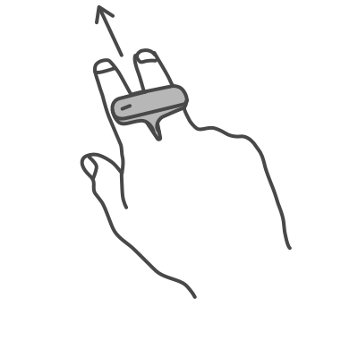
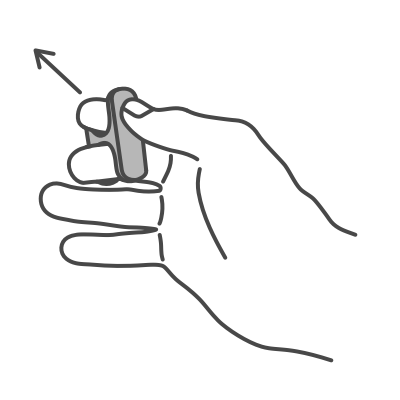
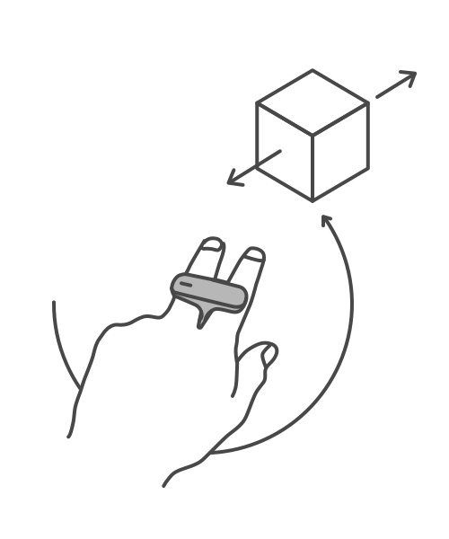
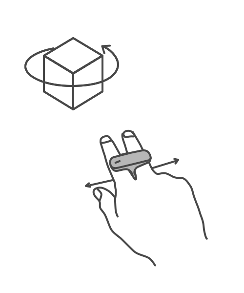
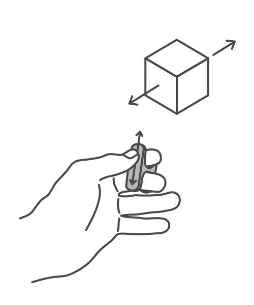
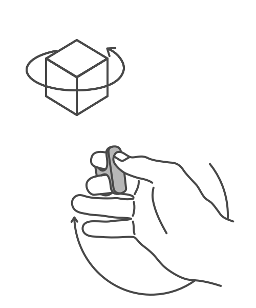

# Using Litho

_Litho beta release 0.4.3 (28/10/2019)_

## Contents

* [Charging Litho](#charging-litho)
* [Wearing Litho](#wearing-litho)
* [Litho Interactions](#litho-interactions)

---

## Charging Litho

Make sure your Litho is charged before you use it. You can charge Litho using a micro-USB cable, which plugs into the port on the lower rear face of the device. Litho takes around 90 minutes to reach full charge, although it can still be used for shorter periods after shorter periods of charge. In some Litho apps, the battery level of the Litho you're using will be displayed on the phone screen. 

---

## Wearing Litho

* Slide your Litho onto the index and middle fingers on your dominant hand.
* **It is important that the micro-USB port is nearest to where your fingers join the palm of your hand, so that the port is facing towards you.**
* Your thumb on your dominant-hand should easily interact with the touchpad on the underside of your Litho. 

### Litho Stance

* Stand in a comfortable position.
* Hold your phone in your non-dominant hand. 
* Your dominant hand should hang loosely at your side, wearing your Litho.
* Raise your Litho just as much as is required to point where you want to. There is no need to raise your Litho above elbow-height for most applications. 

### Litho Grips

There are currently two different ways of wearing Litho on your hand - using the _Point_ grip and the _Clutch_ grip. Note that objects are manipulated in slightly different ways in each of these grips.

If you are **left-handed**, all of these instructions still apply, but you will need to switch to left-handed mode in whichever app you are using.

|  **Point Grip** |  **Clutch Grip** |
|:--- | :--- |
| The Point grip is best-suited to interacting with objects on the floor. It also provides fine control when manipulating objects to be closer to or further away from you. | The Clutch grip is best-suited to interacting with objects with intuitive depth control, and provides fine control when interacting with the touchpad.|
|<ol><li>Litho is worn on the index and middle fingers. </li><li>The micro-USB port sits snug in the crease where your fingers join the palm of your hand. </li><li>The palm of your hand faces the floor with first two **fingers extending forwards**.</li><li>To interact, reach your thumb under to the touchpad on the bottom of your Litho. </li></ol> | <ol><li>Litho is worn **halfway down the index and middle fingers**. </li><li>**Hand loosely half-closed into a fist** with the touchpad facing upwards.</li><li>The micro USB port should be on the edge facing your wrist.</li><li>**Thumb reaches forward** to interact with the **touchpad**.</li></ol> |

---

## Litho Interactions

Litho interactions are usually performed by pointing at the object you want to interact with, then touching and holding your thumb on the touchpad surface. Certain objects can be moved by then pointing to a new location in the world. You should see the object follow to wherever you point.

### Fine Control

More intricate movements such as rotation and moving an object closer or further away depend on how you are [wearing Litho](#wearing-litho).

### Point Controls

|  **Depth** |  **Rotation** |
| :--- | :--- |
| While holding an object that can be moved, **tilt your Litho left and right** to control its distance from you. This motion can be made easier by orienting your hand at 45 degrees when first grabbing the object. | While holding an object that can be rotated, **slide your finger left and right** along the touchpad. The position of your finger maps to the yaw (horizontal-plane rotation) of the object you are holding. |

### Clutch Controls

|  **Depth** |  **Rotation** |
|:--- | :--- |
| Whilst holding an object that can be moved, **slide your finger up and down** on the touchpad. | Whilst holding an object that can be rotated, gently **tilt your hand left or right** to control the yaw of the object |

---

# Navigation

[Home](../README.md)

[Litho Features](../Features/README.md)

\> [Guide to using Litho](UsingLitho.md)

[Set up your Litho project](ProjectSetup.md)

[Learn how the Litho demo scene works](DemoScene.md)

[Build your scene for iOS or Android](BuildInstructions.md)

[Integrate Litho into your Unity scene](UnityIntegration.md)

[Code your own Litho scripts](UnityScripting.md)

[Test your scene using the Litho Emulator](../Features/LithoEmulator.md)

[FAQs & Troubleshooting](../FAQ.md)

[Changelog](../Changelog.md)

---
