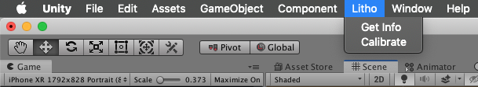

# Learn how the Litho demo scene works

_Litho beta release 0.3.0 (06/08/2019)_

## Contents

* [Video Tutorial](#video-tutorial)
* [Instructions Litho Example Scene](#instructions-litho-example-scene)
* [Litho Example Scene Overview](#litho-example-scene-overview)

---

## Video tutorial

<a href="https://vimeo.com/342822311#t=123s" target="_blank">

Watch the setup tutorial on Vimeo</a>

---

## Instructions for Litho example scene:

1. **Open the example scene** (_/Litho/Scenes/LithoExample.unity_)
2. **Press _Play_** to run the scene (the _Play_ button should remain depressed and glow blue)
3. **Wait for your Litho device name to appear** on the list in the Game view (ensure Bluetooth is enabled on your Mac, and that your Litho device is charged - plug it in if unsure) - this may take a short while the first time you run the scene
4. In the Game view, **connect to your Litho** device by clicking its name - the button will update to say it is "Connecting..." - wait briefly while the connection is established
5. **Calibrate your Litho** with the Unity editor:

    **Calibrate in game view:**
    1. Click the _Calibrate Litho_ button
    1. Make sure you are wearing Litho in the correct grip (configured by your app; default is [Point grip](UsingLitho.md#litho-grips))
    2. Read the calibration conditions listed on the overlay screen that appears
    3. Click the _Calibrate Litho_ button to complete the calibration process

    **Calibrate using the Unity Menu:**

    
    1. Make sure you are wearing Litho in the correct grip (configured by your app; default is [Point grip](UsingLitho.md#litho-grips))
    2. Point in an arbitrary direction (e.g. towards your screen) to use as 'Forwards' whilst testing your app
    3. In application menu bar press _Litho -> Calibrate_

7. You should now be able to **see a laser pointer** protruding from the _Litho_ object, which should be tracking your real-world Litho position and orientation relative to the _ARCamera_ object
8. **Touching the trackpad** on the underside of your Litho should trigger a visualisation in the top-left of the Game view user interface
9. By **pointing at the cube** in the game world, and **touching and holding the track pad** on the bottom of your Litho, you should be able to **manipulate the cube** in 3D space. Whilst holding in [Point grip](UsingLitho.md#litho-grips), twist your wrist left and right to move the cube along the axis of the pointer
10. When finished, click the _Play_ button again to **stop the scene** (the _Play_ button should return to it's unpressed state)

---

## Litho example scene overview

More detailed information is available [here](UnityScripting.md#augmented-reality-and-interaction-overview).

| Description | Unity Editor |
| :--- | :--- |
|<ol><li>**LithoCanvas** \- contains a hierarchy of UI components and a _UIManager_ that interact with the components that control UI for device selection, device info, and calibration </li><li> **ARSessionOrigin** \- contains a custom Litho _WorldInterpreter_ script that handles basic plane identification and ground plane management, as well as the default session management components for an AR Foundation scene (see [AR Foundation](https://docs.unity3d.com/Packages/com.unity.xr.arfoundation@2.0/manual/index.html))</li><li>**ARCamera** \- has default AR Foundation camera management components on it, including the _Tracked Pose Driver_, which allows the Unity game camera position to match the real world camera position once the app is built </li><li>**Litho** \- gets positioned by its _Litho_ component and exposes Litho-related events; also hosts a _Pointer_ script which handles interaction with GameObjects hosting the _InteractableObject_ component </li><li> **Ground** \- gets positioned at the detected ground level by the _WorldInterpreter_ component on the _ARSessionOrigin_ object </li><li>**DemoInteractableObject** \- hosts an instance of the _InteractableObject_ component, which allows it to be moved and manipulated by the _Pointer_ component attached to the _Litho_ object; also has a _LithoInteractionDemo_ component, which makes a basic attempt to prevent the object from being lost by the user </li><li>**DemoEventObject** \- hosts an instance of the _LithoEventDemo_ component, which demonstrates how to use the events exposed by the _Litho Object_ </li> |  |

---

# Navigation

[Guide to using Litho](UsingLitho.md)

[How to setup your Litho project](ProjectSetup.md)

[Learn how the Litho demo scene works](DemoScene.md)

[Build your scene for iOS using Xcode](BuildXcode.md)

[Integrate Litho into your Unity scene](UnityIntegration.md)

[Best practice for coding your own scripts with Litho](UnityScripting.md)

[FAQs & Troubleshooting](FAQ.md)

[Changelog](Changelog.md)

---
