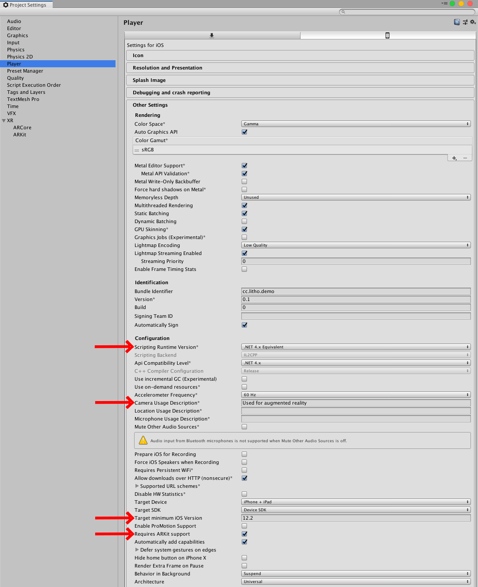
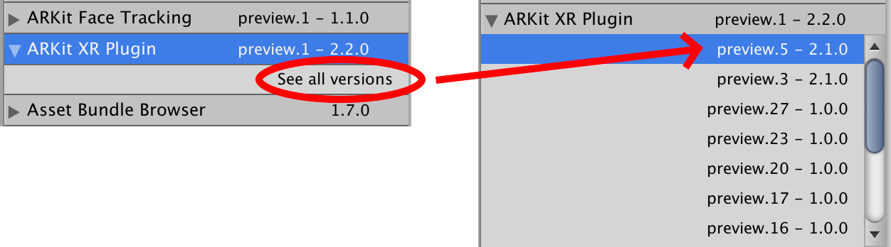
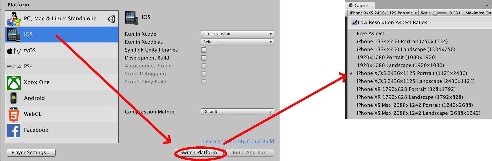

# Setting up your Litho project

_Litho beta release 0.3.0 (06/08/2019)_

## Contents

* [Video Tutorial](#video-tutorial)
* [Instructions for first use of the Litho SDK](#instructions-for-first-use-of-the-litho-sdk)

---

## Video tutorial

<a href="https://vimeo.com/342822311" target="_blank">

Watch the setup tutorial on Vimeo</a>

---

## Instructions for first use of the Litho SDK:

#### 1. Create your project:

1. Open **Unity Hub** 
2. Ensure you have **Unity version 2019.1.6f1** installed _(other versions may work but are not yet tested; alpha and beta versions are not recommended; older versions are unlikely to support the required AR Unity packages)_
3. Ensure Unity 2019.1.6f1 has **iOS build support** installed _(if not, the additional options menu should allow you to install it via the _Add Modules_ option)_ 
4. On the Projects screen, use the dropdown menu next to the _New_ button to create a **new 3D project** with Unity **2019.1.6f1**, then open it 

---

#### 2. Prepare your project:

1. Open Player Settings ( _Edit -> Project Settings -> Player_)
2. Select the _iOS settings_ tab (click the small mobile phone icon)
3. Expand _Other Settings_ and scroll down to find the options noted below
4. Ensure **_Scripting Runtime Version_** is set to **_.NET 4.x Equivalent_** or higher 
5. Ensure **_Camera Usage Description_** is filled in with **_"Used for augmented reality"_**
6.  Ensure **_Target minimum iOS Version_** is set to **_12.2_** (or whatever iOS version you intend to use) 
7. Ensure **_Requires ARKit support_** is **checked (true)**

---

#### 3. Install AR Foundation and ARKit:

1. Open Package Manager ( _Window -> Package Manager_).
 Ensure drop-down menu at the top-left (near the _+_ button) reads _All packages_ (not _In Project_) 
2. Click _Advanced_ drop-down menu to tick _Show preview packages_ - this may cause a delay whilst additional packages load 
3. Click the arrow next to **AR Foundation** to select and install **version 2.2.0** 
4. Click the arrow next to **ARKit XR Plugin** to select and install **version 2.1.0** - later versions may be unstable, so may not build correctly

---

#### 4. **Import the Litho Unity package** into your Unity project:
1. Locate the .package file for the Litho SDK 
2. Drag and drop the .package file into the _Assets_ folder in the Project view 
3. In the Import Unity Package view (which should have popped up), ensure all package components are ticked (included in the import) 
4. In the Import Unity Package view, click _Import_

---

#### 5. Set up your Game view for iPhone X compatibility:

_(The Litho user interface is designed for iPhone X, however other resolutions should work)_

1. Open the Game view (_Window -> General -> Game_)
2. Open the resolution drop-down menu in the top-left of the Game view (it may read as _"Free Aspect"_ or _"iPhone 5 Tall"_, for example) 
3. **Select iPhone X/XS 2436x1125 Portrait** if it is available; otherwise, create a new option labelled "iPhone X Portrait" (by clicking the "+" at the bottom of the list) with _Type_ set as _Fixed Resolution_, and a width and height of _1125_ and _2436_ respectively

4. Ensure the _Scale_ slider is set to the lowest possible value 

---

# Navigation
[Guide to using Litho](UsingLitho.md)

[Setting up your Litho project](ProjectSetup.md)

[Learn how the Litho demo scene works](DemoScene.md)

[Build your scene for iOS using Xcode](BuildXcode.md)

[Integrate Litho into your Unity scene](UnityIntegration.md)

[Best practice for coding your own scripts with Litho](UnityScripting.md)

[FAQs & Troubleshooting](FAQ.md)

[Changelog](Changelog.md)

---
