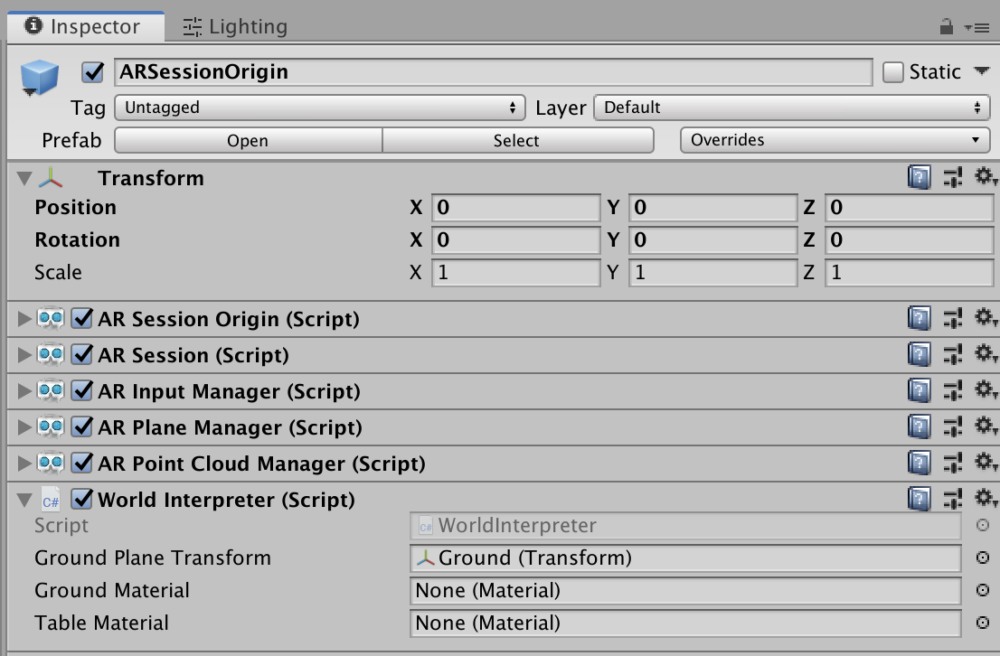
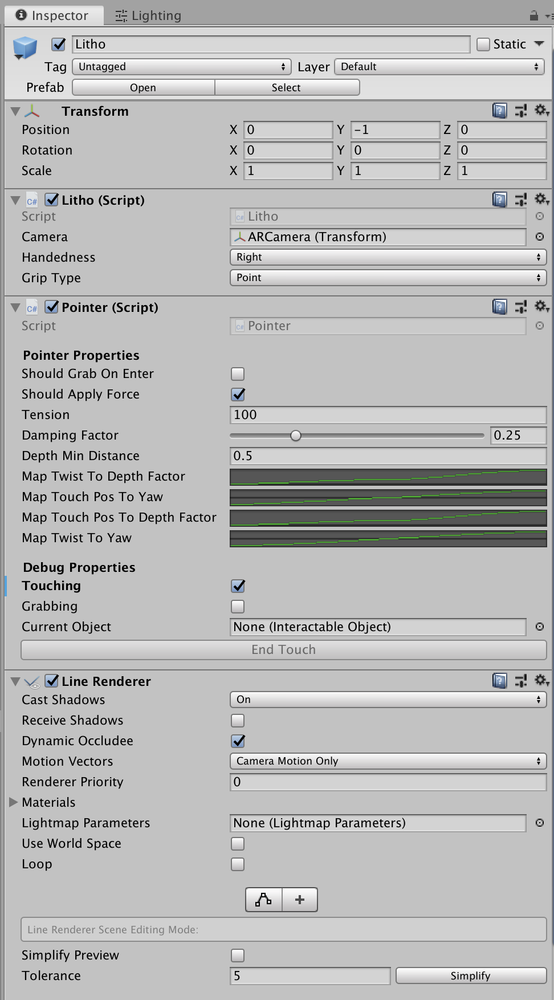
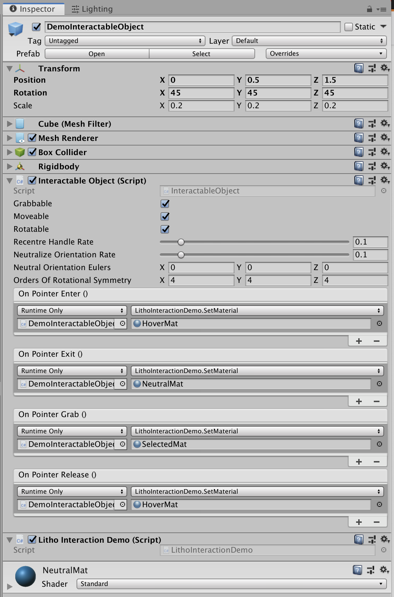

# Integrate Litho into your Unity scene


_Litho beta release 0.3.1 (07/08/2019)_

## Contents

* [ARSessionOrigin Object](#ar-session-origin-object)
* [Litho Object](#litho-object)
* [Interactable Object](#interactable-object)
* [Demo Event Object](#demo-event-object)

---

## AR Session Origin Object

To make Litho work in AR, the project [relies on the AR Foundation package](ProjectSetup.md#install-ar-foundation-and-arkit). This prefab contains the other Litho and AR objects to make the scene work. Here we will only mention the crucial elements that make AR Foundation work with Litho. Further details can be found [here](UnityScripting.md#ar-foundation)

| Description | Unity Editor |
| :--- | :--- |
|<ol><li>**Transform** of the AR session origin</li><li>**AR Session Origin Script**</li><li>**AR Session**</li><li>**AR Input Manager Script**</li><li>**AR Plane Manager Script** is used to generate AR representations of real-world planes within your app</li><li>**AR Point Cloud Manager**</li><li>**World Interpereter Script** is essential for Litho to work. It uses AR Foundation to determine where the ground is, then places the ground object (a child of the _ARSessionOrigin_ object) at the correct height. This removes the need to scan the entire room before using the app</li></ol> | |

---

## Litho Object

The _Litho_ object represents your Litho in the scene. **Only 1 copy of this object should exist in your scene.** The laser pointer is cast from this object, which is positioned relative to the camera. The _Litho_ object prefab can be found in the demo scene and should be a child of the _ARSessionOrigin_ object. When building your own Litho scene, make the _Litho_ prefab a child of the ARSessionOrigin object, and ensure you provide the _Litho_ object with a reference to the main AR camera object in your scene. Further details can be found [here](UnityScripting.md#litho-sdk)

| Description | Unity Editor |
| :--- | :--- |
|<ol><li>**Transform** represents the real-world position of your connected Litho in game world/ AR coordinates. **Do not modify this manually or in other scripts** as it is overridden by the _Litho_ script. </li><li>**Litho (Script)** needs a reference to the main AR camera to function (if not set, any object tagged with MainCamera will be used). Code in this script **should not be modified**, as it communicates directly with the Litho Plugin. However, you can set the default Litho _handedness_ and _grip_ here using the Unity Inspector window, and override the defaults whilst in play mode.</li><li>**Pointer Script** controls the behaviour of the laser pointer and uses the Unity's Line Renderer to visualize it.</li><li>**Line Renderer** is a standard Unity component that renders the laser pointer. Modify the properties and materials here to change how the laser pointer looks.</li></ol> |  |

---

## Demo Interactable Object

The _DemoInteractableObject_ prefab serves as an example of how to allow objects to interact with Litho in your scene. The prefab is a cube that has a mass and can be grabbed, moved and rotated using your Litho. The _InteractableObject_ script gives you all the freedom you need to create unique objects, from throwable objects to floating buttons

| Description | Unity Editor |
| :--- | :--- |
|<ol><li>**Transform**  of the interactable object</li><li>**Cube (Mesh Filter)** determines the shape of the object (the default here is a cube).</li><li>**Mesh Renderer** renders the object.</li><li>**Box Collider** is required for the Litho laser pointer to know where the object is (modify or swap this to other 3D colliders to match the shape of your object as required; 2D colliders are not currently supported).</li><li>**Rigid Body** handles the motion of the object - only necessary if the object is 'movable'</li>**Interactable Object (Script)**<ul><li>**Grabable** if the object can be grabbed by the laser pointer (the end of the pointer will 'stick' to the object when it is grabbed)</li><li>**Moveable** determines whether the object can be moved by the Litho pointer</li><li>**Rotatable** determines whether the object can be rotated using Litho _(overrules Rigidbody constraints)_</li><li>**Recentre Handle Rate** determines whether, and how fast, the point you grabbed on an object gets moved to the centre of that object</li><li>**Neutralize Orientation Rate** determines the rate at which the object is forcibly re-oriented to an upright orientation, as defined by its orders of rotational symmetry (you must be holding the object by its centre - use Recentre Handle Rate to enforce this).</li><li>**Neutral Orientation Eulers** are used to determine what 'upright' means when neutralizing orientation.</li><li>**Orders Of Rotational Symmetry** describes the rotational symmetry of the object about the x,y,z axes</li><li>**OnPointerEnter()** occurs when the laser pointer begins pointing at this object.</li><li>**OnPointerExit()** occurs when the laser pointer stops pointing at this object, or after the object is released (if it was being held).</li><li>**OnPointerGrab()** occurs (if this object is 'grabbable') when the Litho touchpad is pressed whilst the laser is pointing at this object.</li><li>**OnPointerRelease()** occurs (if this object is being held by the pointer) when the Litho touchpad is released.</li></ul></li></ul><li>**Litho Interaction Demo (Script)** makes a basic attempt to prevent this object from being lost by the user (respawns it when it moves significantly out of sight of the camera).</li></ol> |  |

---

## Demo Event Object

The _DemoEventObject_ prefab shows you how to access the events exposed by the _Litho_ script (this script is not critical to the Litho system - **you can delete this object** without any issues). All it does is find the _Litho_ script in the scene, subscribe to its events, and send notification messages to the Unity Console when those events occurs. Use this class as a reference for accessing _global_ (not object-specific) Litho events

Browse the code in _LithoEventDemo.cs_ to understand how Litho events can be subsribed to - below is an example:

Define the _HandleLithoTouchStart()_ function so that it prints a message to the Unity Console:  
```cs
private void HandleLithoTouchStart(Vector2 position, Vector2 worldPosition)
{
    Debug.LogFormat("Litho: touch started at position ({0}, {1})",
                    worldPosition.x, worldPosition.y);
}
```

At a relevant point in the code (e.g. in the script's Start() method), find a reference to the _Litho_ script:  
```cs
Litho litho = FindObjectOfType<Litho>();
```

Tell this script to call the _HandleLithoTouchStart()_ function at the moment the touchpad on the currently connected Litho is touched:  
```cs
litho.OnTouchStart += HandleLithoTouchStart;
```

Now, every time a touch starts on the Litho touchpad, _HandleLithoTouchStart()_ function will be called, which will print the touch data to the Unity Console window

It is recommended that you read [this additional information](UnityScripting.md#litho-events) regarding Litho events

---

# Navigation

[Guide to using Litho](UsingLitho.md)

[How to setup your Litho project](ProjectSetup.md)

[Learn how the Litho demo scene works](DemoScene.md)

[Build your scene for iOS using Xcode](BuildXcode.md)

[Integrate Litho into your Unity scene](UnityIntegration.md)

[Best practice for coding your own scripts with Litho](UnityScripting.md)

[FAQs & Troubleshooting](FAQ.md)

[Changelog](Changelog.md)

---
